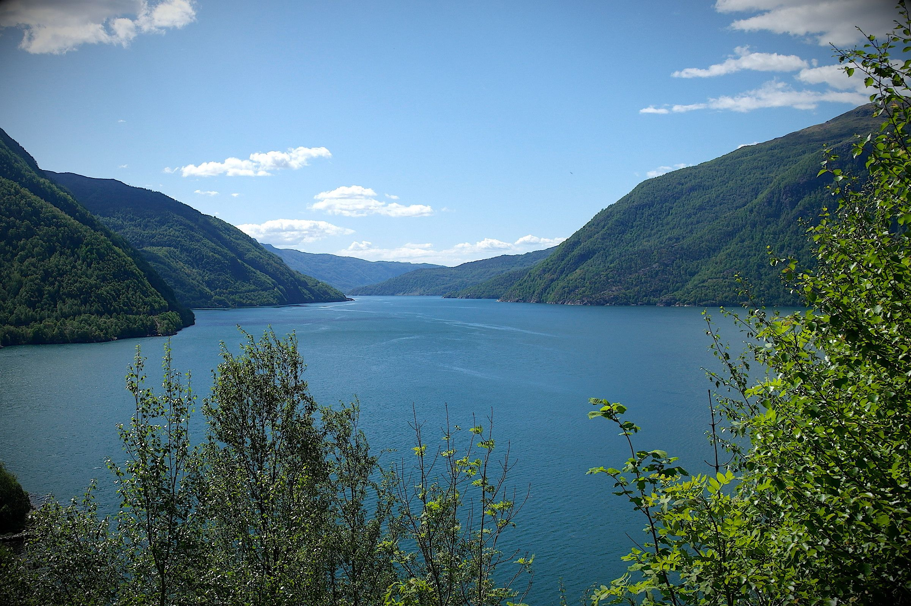

The path to awakening is not walked in moments, but in movements—shaped by quiet repetition, not urgency. Truth reveals itself to those who return with patience, undisturbed by doubt or delay. The one true direction emerges through rhythm and resilience, until their very being becomes the key, and clarity opens without force.
